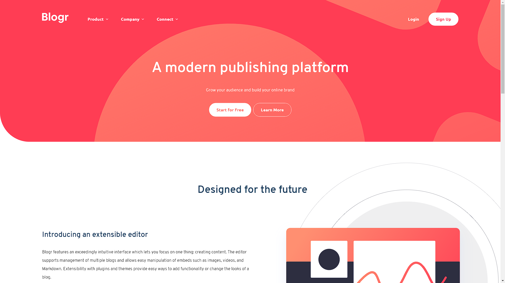
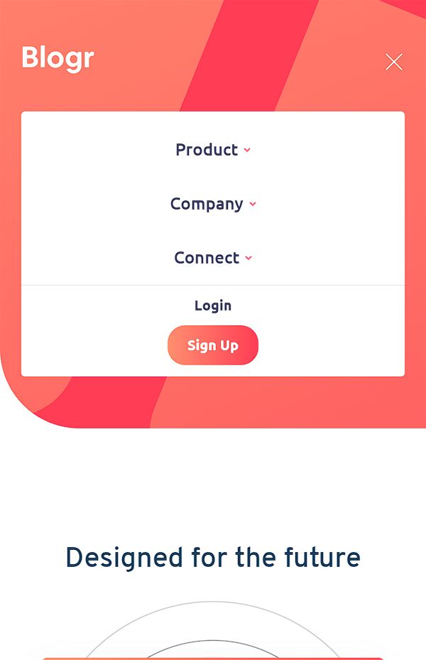

# Frontend Mentor - Blogr landing page solution

This is a solution to the [Blogr landing page challenge on Frontend Mentor](https://www.frontendmentor.io/challenges/blogr-landing-page-EX2RLAApP). Frontend Mentor challenges help you improve your coding skills by building realistic projects. 

## Table of contents

- [Frontend Mentor - Blogr landing page solution](#frontend-mentor---blogr-landing-page-solution)
  - [Table of contents](#table-of-contents)
  - [Overview](#overview)
    - [The challenge](#the-challenge)
    - [Screenshot](#screenshot)
      - [Desktop](#desktop)
      - [Mobile](#mobile)
    - [Links](#links)
  - [My process](#my-process)
    - [Built with](#built-with)
    - [What I learned](#what-i-learned)
    - [Useful resources](#useful-resources)
  - [Author](#author)
  - [Acknowledgments](#acknowledgments)


## Overview

### The challenge

Users should be able to:

- View the optimal layout for the site depending on their device's screen size
- See hover states for all interactive elements on the page

### Screenshot
#### Desktop

#### Mobile


### Links

- Solution URL: [Github Repository](https://github.com/huirayj/fm-blogr-landing-page)
- Live Site URL: [Deployed Site](https://huirayj.github.io/fm-blogr-landing-page/)

## My process

### Built with

- Semantic HTML5 markup
- CSS
- Flexbox
- CSS Grid
- JavaScript

### What I learned

In this exercise, I learned to use the "content" property to change the source of images when swapping to mobile, as well as practicing CSS Grid.

```css
@media only screen and (max-width: 600px) {
    #introduction-img {
            content: url('../images/illustration-editor-mobile.svg');
            transform: translateX(0);
            margin: 2rem 0;
        }
}
```

In this snippet, the source of the image changes when switched to a mobile view.

### Useful resources

- [Grid by Example](https://gridbyexample.com/) - This helped me better understand CSS Grid layouts.
- [content](https://developer.mozilla.org/en-US/docs/Web/CSS/content) - This is an amazing article which helped me finally understand the CSS "content" property

## Author

- Website - [Justin Hui](https://huirayj.github.io/react-portfolio/)
- Frontend Mentor - [@huirayj](https://www.frontendmentor.io/profile/huirayj)

## Acknowledgments

Thank you, Frontend Mentor for providing this opportunity to practice and learn about Frontend Web Development.
